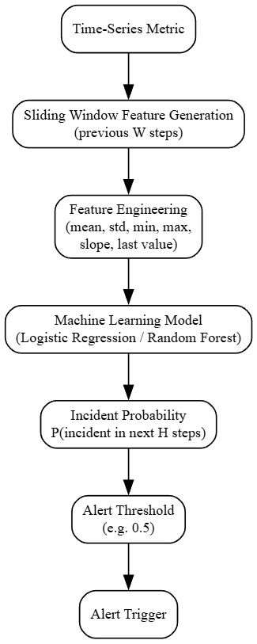

# Predictive Alerting for Cloud Metrics

This repository implements a **predictive alerting system for cloud infrastructure metrics**.  
The goal is to predict whether an **incident will occur within the next `H` time steps** based on the **previous `W` time steps** of a time-series metric.

The implementation follows a **sliding-window supervised learning formulation**, which converts a time-series forecasting problem into a binary classification task.

The project emphasizes:

- correct **problem formulation**
- appropriate **model selection**
- clear **evaluation methodology**
- analysis of results

rather than complex datasets or large models.

---

# Problem Formulation

In cloud monitoring systems, metrics such as CPU utilization, memory usage, or request latency are continuously tracked. Incidents often correspond to **anomalous spikes or abnormal behavior** in these metrics.

Instead of detecting incidents only after they happen, predictive alerting aims to **anticipate incidents before they occur**.

We formulate the problem as:

> Given the previous `W` observations of a time-series metric, predict whether an incident will occur within the next `H` time steps.

Where:

- `W` = look-back window size  
- `H` = prediction horizon

This produces a supervised dataset:
`X_t` = previous W metric values
`y_t` = 1 if an incident occurs within the next H steps

This formulation allows the use of standard machine learning models for predictive alerting.

# System Architecture


---

# Dataset

The dataset used in this project comes from the **Numenta Anomaly Benchmark (NAB)**.

Dataset file: **cpu_utilization_asg_misconfiguration.csv**

This dataset contains:

- time-stamped CPU utilization values
- real cloud infrastructure behavior
- anomaly patterns similar to incidents in production monitoring systems

NAB is a well-known benchmark dataset designed for evaluating anomaly detection and predictive monitoring systems.

Repository:

https://github.com/numenta/NAB

---

# Incident Labeling

The dataset does not directly contain incident labels. Therefore, incidents are defined using a **high-percentile threshold approach**.

Steps:

1. Compute the **99th percentile** of CPU utilization on the **training data**.
2. Any value exceeding this threshold is treated as an **incident point**.
3. A training label `y_t = 1` is assigned if any incident occurs within the next `H` steps.

This approach mimics real monitoring systems where alerts trigger when metrics exceed critical thresholds.

---

# Feature Engineering

For each time step `t`, features are constructed from the **previous `W` metric values**.

The feature vector includes:

- raw window values
- mean of the window
- standard deviation
- minimum value
- maximum value
- slope proxy (`last - first`)
- most recent metric value

These features capture:

- level
- variability
- short-term trends
- recent system behavior

---

# Model Selection

Two models were evaluated:

### Logistic Regression

A simple and interpretable baseline model.

Advantages:

- fast training
- interpretable
- well-suited for probabilistic prediction

---

### Random Forest

A non-linear ensemble model.

Advantages:

- captures non-linear relationships
- robust to noisy features
- often performs well on tabular datasets

---

# Hyperparameters

Window size (W): `20`

Prediction horizon (H): `5`

Train/Test split: 70% / 30% (time-based)

### Random Forest:

n_estimators = `200`

max_depth = `6`

---

# Evaluation Methodology

To avoid data leakage, the dataset is split using a **time-based split** rather than random shuffling.

Training data: first 70%
Test data: remaining 30%

## Model outputs probabilities:

P(incident in next H steps)

These probabilities are converted into alerts using different thresholds.
Three thresholds were evaluated:
`0.3`
`0.5`
`0.7`

## Metrics reported:

- Precision
- Recall
- F1 Score
- ROC-AUC
- Confusion Matrix

---

# Results

## Logistic Regression

ROC-AUC: 
`0.8186`

Threshold results:

| Threshold | Precision | Recall | F1 |
|----------|----------|-------|------|
| 0.3 | 0.476 | 0.744 | 0.580 |
| 0.5 | 0.621 | 0.602 | 0.611 |
| 0.7 | 0.784 | 0.423 | 0.549 |

---

## Random Forest

ROC-AUC: 
`0.8404`


Threshold results:

| Threshold | Precision | Recall | F1 |
|----------|----------|-------|------|
| 0.3 | 0.493 | 0.804 | 0.611 |
| 0.5 | 0.705 | 0.666 | 0.685 |
| 0.7 | 0.833 | 0.398 | 0.538 |

---

# Best Operating Point

The best balance between false positives and missed incidents is achieved with:
Random Forest
Threshold = 0.5

## Metrics:

Precision: `0.705`

Recall: `0.666`

F1 Score: `0.685`

This configuration provides a practical trade-off between:

- alert sensitivity
- alert fatigue from false positives

---

# Observations

Several insights emerge from the results:

1. **Random Forest consistently outperforms Logistic Regression**, indicating the presence of non-linear relationships in the metric behavior.

2. **Lower thresholds increase recall but produce more false positives**, while higher thresholds reduce false alerts but miss incidents.

3. The dataset exhibits **distribution shift**:
   - Training incident rate: ~8%
   - Test incident rate: ~20%

This reflects **non-stationarity**, which is common in real cloud systems where workloads change over time.

---

# Limitations

This implementation is intentionally simple to focus on correct formulation and evaluation.

Limitations include:

- incidents defined using percentile threshold instead of real incident logs
- single-metric dataset
- no concept drift adaptation
- no temporal models (e.g., LSTM or Transformers)

---

# How This Would Work in Production

In a real monitoring system, this approach would be extended by:

- using multiple metrics (CPU, memory, latency, errors)
- training on historical incident tickets or alarm states
- retraining periodically to handle distribution shift
- service-specific alert thresholds
- integration with monitoring platforms (CloudWatch, Prometheus, Datadog)

The model would output a **probability of incident**, and alerts would trigger when this probability exceeds a configured threshold.

---

# Project Structure

```bash
predictive-alerting-cloud-metrics/
│
├── data/
│ └── cpu_utilization_asg_misconfiguration.csv
│
├── results/
│ ├── metrics.json
│ └── predictions.csv
│
├── src/
│ ├── data_utils.py
│ ├── features.py
│ └── train.py
│
├── requirements.txt
├── .gitignore
└── README.md
```

---

# How to Run

Install dependencies:

```bash
pip install -r requirements.txt
```

Run the training pipeline:
```bash
python src/train.py
```

The script will:
- Download the dataset
- Generate sliding-window features
- Train both models
- Evaluate thresholds
- Save results in `results/`

# Key Takeaways

This project demonstrates a practical implementation of predictive alerting for cloud metrics using a sliding-window machine learning approach.

The experiment shows that even simple models can provide useful predictive signals for incident anticipation, especially when combined with proper evaluation and threshold tuning.

---

# Future Improvements

Several improvements could extend this prototype into a production-grade alerting system:

### 1. Multivariate Metrics
Real cloud monitoring systems use multiple metrics simultaneously
(CPU, memory, latency, error rates).

### 2. Temporal Models
Sequence models such as:

- LSTM
- Temporal Convolution Networks
- Transformers

could capture longer temporal dependencies.

### 3. Concept Drift Handling
Cloud workloads change over time. Possible approaches:

- rolling retraining
- drift detection
- adaptive thresholds

### 4. Alert Suppression Logic
Production alerting systems typically implement:

- cooldown periods
- alert grouping
- incident deduplication

to reduce alert fatigue.

### 5. Lead-Time Optimization
Future work could optimize the model specifically for:

- maximizing incident lead-time
- minimizing false alerts
